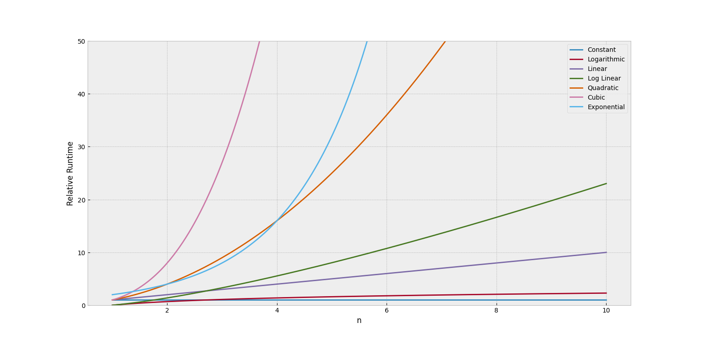

# algorithms-scala
Algorithms and Data Structures in Scala

## Big O Notation

| Big-O    | Name         |
|----------|--------------|
| 1        | Constant     |
| log(n)   | Logarithmic  |
| n        | Linear       |
| nlog(n)  | Log Linear   |
| n^2      | Quadratic    |
| n^3      | Cubic        |
| 2^n      | Exponential  |

## Big O Notation for Scala Data Structures

https://docs.scala-lang.org/overviews/collections/performance-characteristics.html

